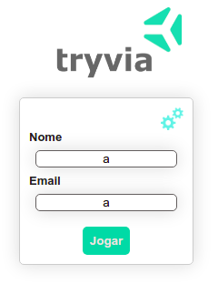

## Instruções

Este projeto foi produzido enquanto eu estudava na [Trybe](https://www.betrybe.com/), e consite em um jogo de Trivia utilizando `React` e `Redux`. A aplicação pode ser acessada através [deste deploy](sad-booth-b6a258.netlify.app).

Ao acessar o link, o botão de `Jogar` vai estar desabilitado, mas basta que os campos não estejam vazios para que o botão fique dispoível.

  
  

Caso você queira rodar o código localmente, basta seguir as instruções abaixo:

1. Clone este [repositório](git@github.com:JefersonSchimuneck/trivia-react-redux.git): 
   - `git clone git@github.com:JefersonSchimuneck/trivia-react-redux.git`
2. Entre na pasta do repositório que você acabou de clonar:
   - `cd trivia-react-redux`
3. Instale as dependências
   - `npm install`
4. Inicialize a aplicação
   - `npm start`
   -  O navegador executará a aplicação no endereço `http://localhost:3000/`

---

Qualquer dúvida estou à disposição e obrigado pela atenção!

[Jeferson Schimuneck](https://www.linkedin.com/in/jeferson-schimuneck/)